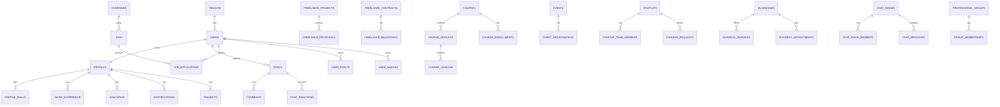

```mermaid
erDiagram
    TENANTS ||--o{ USERS : "has"
    USERS ||--|| PROFILES : "owns"
    PROFILES ||--o{ PROFILE_SKILLS : "has"
    PROFILES ||--o{ WORK_EXPERIENCE : "has"
    PROFILES ||--o{ EDUCATION : "has"
    PROFILES ||--o{ CERTIFICATIONS : "has"
    PROFILES ||--o{ PROJECTS : "has"
    
    USERS ||--o{ POSTS : "authors"
    POSTS ||--o{ COMMENTS : "has"
    POSTS ||--o{ POST_REACTIONS : "receives"
    
    COMPANIES ||--o{ JOBS : "posts"
    JOBS ||--o{ JOB_APPLICATIONS : "receives"
    USERS ||--o{ JOB_APPLICATIONS : "applies"
    
    FREELANCE_PROJECTS ||--o{ FREELANCE_PROPOSALS : "receives"
    FREELANCE_CONTRACTS ||--o{ FREELANCE_MILESTONES : "has"
    
    COURSES ||--o{ COURSE_MODULES : "contains"
    COURSE_MODULES ||--o{ COURSE_LESSONS : "contains"
    COURSES ||--o{ COURSE_ENROLLMENTS : "has"
    
    EVENTS ||--o{ EVENT_REGISTRATIONS : "has"
    
    STARTUPS ||--o{ STARTUP_TEAM_MEMBERS : "has"
    STARTUPS ||--o{ FUNDING_REQUESTS : "makes"
    
    BUSINESSES ||--o{ BUSINESS_SERVICES : "offers"
    BUSINESSES ||--o{ BUSINESS_APPOINTMENTS : "has"
    
    CHAT_ROOMS ||--o{ CHAT_ROOM_MEMBERS : "has"
    CHAT_ROOMS ||--o{ CHAT_MESSAGES : "contains"
    
    PROFESSIONAL_GROUPS ||--o{ GROUP_MEMBERSHIPS : "has"
    
    USERS ||--o{ USER_POINTS : "earns"
    USERS ||--o{ USER_BADGES : "earns"
```
